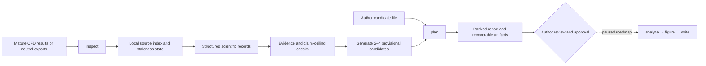

# Architecture overview

CFD-Paper-Agent keeps project state local and separates file discovery from scientific evidence
qualification. In v0.2.0, the CLI coordinates source indexing, structured scientific records,
evidence-bounded topic generation or author-supplied candidates, ranking, and explicit author
approval.

`inspect` records relative source URIs, content identity, and stale/current state. It does not infer
solver semantics or promote files to evidence. Structured case, boundary, QoI, convergence,
conservation, and provenance records must be supplied through current Python contracts or an
adapter that preserves their source locators.

`plan` performs a fast incremental reinspection. When an author candidate file is supplied, it is
validated and ranked. Otherwise the planner discovers comparison and ordered-response
opportunities from mature structured records, constructs two to four provisional candidates, and
records supporting evidence, prohibited inferences, claim ceilings, and minimum missing data.
Missing evidence is a valid result rather than a hidden success.

Offline generation is deterministic. Optional provider refinement may change bounded wording but
cannot introduce evidence, alter numerical relations, or approve a topic. Candidate generation
artifacts are committed atomically to the project-local `.cfdpaper` directory and reused only while
their scientific inputs remain current.

## Local components

| Component | Responsibility | Boundary |
|---|---|---|
| Typer CLI | Expose current commands and non-zero roadmap placeholders | No unattended research decisions |
| Project indexer | Discover files, cache bytes, and track staleness | No scientific evidence qualification |
| SQLite store | Persist project, sources, evidence, QoI definitions, assessments, and checkpoints | Local state; author controls source data |
| Topic generator | Discover bounded opportunities and construct provisional candidates | No evidence invention or automatic approval |
| Planner | Rank generated or author-supplied candidates and write reports | Author approves the final direction |

Analysis, figure generation, writing, review, revision, export, and general solver-native extraction
are not delivered end to end in v0.2.0. Development pauses after this release until explicitly
resumed. See the [public roadmap](../ROADMAP.md).
