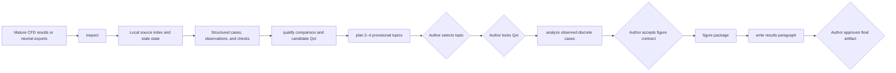

# Architecture overview

CFD-Paper-Agent keeps project state local and separates file discovery from scientific evidence
qualification. The established workflow connects mature structured CFD evidence to a bounded
research direction, an approved quantity of interest (QoI), a discrete analysis, one reproducible
figure, and one results paragraph.

`write --artifact results-section` also accepts a portable declared evidence
package with existing figures. The host AI writes the subsection; the CLI resolves
tokens, recomputes declared CSV results, checks declared coverage, embeds figures,
tables and structured equations in DOCX, and separates review notes.
This additive route does not confer the qualification status of the structured QoI
pipeline on author-supplied evidence.

`inspect` records relative source locations and detects changed inputs. It does not infer solver
semantics or treat file presence as scientific validation.

`qualify` checks the declared comparison, case membership, units, source locations, convergence,
conservation, verification, validation, and proposed QoI. The current public interface expects
structured records and scalar observations rather than arbitrary native solver files.

`plan` ranks an author candidate file or generates two to four provisional directions from mature
records. Offline generation is deterministic. Optional provider refinement may improve bounded
wording but cannot add evidence, alter numerical relations, or approve a topic.

After author selection, the QoI is locked before `analyze` reads the declared discrete sequence.
The analysis records trends and claim ceilings without interpolation, smoothing, or continuous
optimization. `figure` packages source data, a runnable plotting script, editable and preview
graphics, a caption, and focused QA results. `write` produces one results paragraph whose numbers
link back to the analyzed records.

## Local components

| Component | Responsibility | Boundary |
|---|---|---|
| Typer CLI | Coordinate the public workflow and report unavailable commands clearly | No unattended research decisions |
| Project indexer | Discover files and track changed sources | No scientific evidence qualification |
| SQLite store | Persist project state, sources, records, approvals, and checkpoints | Project-local state |
| Topic planner | Propose and rank bounded research directions | Author selects the direction |
| Scientific qualifier | Check comparability, evidence, QoI definition, and reporting limits | Missing evidence remains missing |
| QoI analyzer | Evaluate declared scalar sequences and allowable trends | Observed discrete cases only |
| Figure pipeline | Produce one evidence-linked figure package | No undeclared transformation or general field plotting |
| Table evidence | Calculate declared CSV populations and partitions; resolve current numeric tokens | No automatic choice of scientific operator or missing-value inference |
| Writing pipeline | Assemble numeric paragraphs or host-authored multi-evidence subsections | No complete manuscript or autonomous claim expansion |
| Subsection export | Place figures, native tables and structured mathematics in editable DOCX | Finite elements and configurable layouts, not an arbitrary journal template engine |

Native Fluent and STAR-CCM+ extraction, general field analysis, full-manuscript production,
literature management, pre-submission review and reviewer-response workflows remain future work.
See the [public roadmap](../ROADMAP.md) and [current limitations](../limitations.md).
