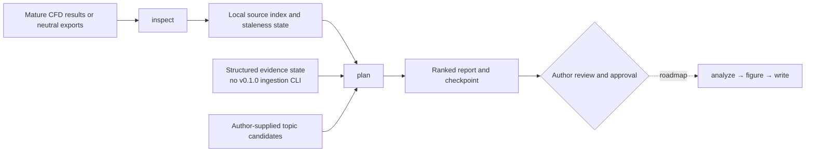

# Architecture overview

CFD-Paper-Agent keeps project state local and separates file discovery from scientific evidence
qualification. The v0.1.0 public architecture is deliberately narrow: a CLI coordinates a file
index, a SQLite state store, deterministic checkpoints, and author-supplied topic ranking.

`inspect` snapshots discoverable project files into a content-addressed cache, records relative
source URIs, and updates stale/current state. It does **not** infer solver semantics or promote a
file to verified evidence. Structured evidence records, when present through current contracts,
retain source locators, hashes, maturity, and stale status.

`plan` accepts a schema-v1 author candidate envelope, performs a fast incremental reinspection,
and ranks candidates against the evidence state. It writes a JSON report and an atomic workflow
checkpoint in the project-local `.cfdpaper` directory. A missing-evidence outcome is a valid,
expected boundary rather than a hidden success.

Author approval is explicit and evidence-dependent. It records a selected direction or topic
scope but does not launch any downstream roadmap command. Analysis, figure generation, writing,
review, revision, export, and general solver-native extraction are not delivered end to end in
v0.1.0.

## Local components

| Component | Responsibility | Boundary |
|---|---|---|
| Typer CLI | Expose current commands and non-zero roadmap placeholders | No unattended research decisions |
| Project indexer | Discover files, cache bytes, chunk text, and track staleness | No scientific evidence qualification |
| SQLite store | Persist project, source, evidence, stage, and checkpoint records | Local state; author controls source data |
| Planner | Validate candidate JSON, rank against evidence, and write a report | Author supplies candidates in v0.1.0 |

The [public roadmap](../ROADMAP.md) promotes later components only after their executable contracts,
tests, evidence boundaries, and artifacts are released.
